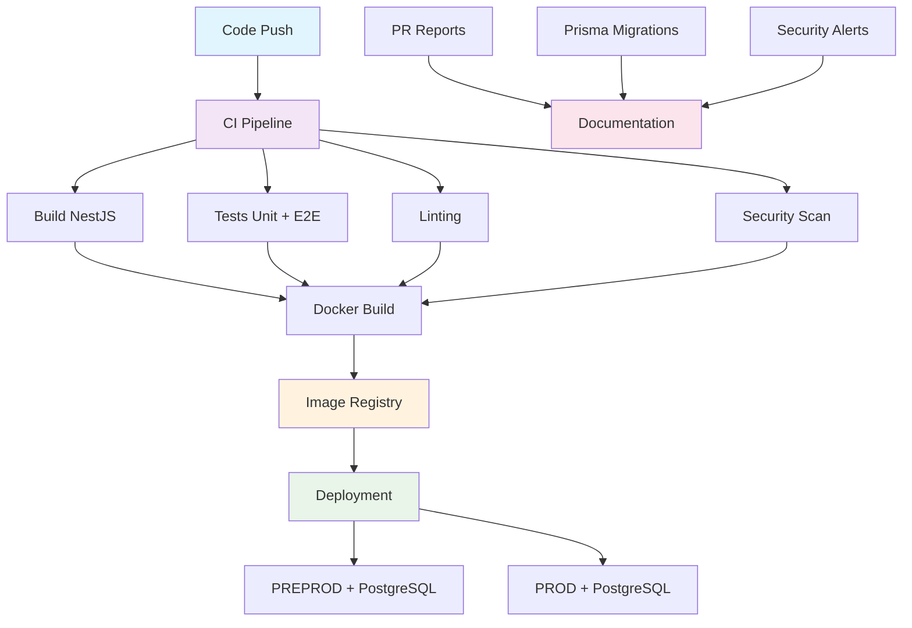

# 🚀 DevOps - Backend NestJS

## Vue d'ensemble

Cette section documente l'ensemble de l'infrastructure DevOps pour le backend NestJS, incluant la CI/CD, le déploiement avec base de données PostgreSQL externe.

## 📋 Table des matières

### 🔄 [CI/CD Pipeline](ci-cd-pipeline.md)
- Architecture du pipeline
- Workflows GitHub Actions
- Gestion des environnements
- Stratégies de déploiement

### 🐳 [Déploiement](deployment.md)
- Guide de déploiement
- Configuration des environnements
- Commandes Docker
- Dépannage

## 🏗️ Architecture DevOps

## 🔧 Outils utilisés

| Catégorie | Outils | Description |
|-----------|--------|-------------|
| **CI/CD** | GitHub Actions | Pipeline d'intégration continue |
| **Build** | NestJS CLI, npm | Compilation et packaging |
| **Tests** | Jest, ESLint, Semgrep | Tests unitaires, e2e, qualité et sécurité |
| **Database** | PostgreSQL, Prisma | Base de données et ORM |
| **Containers** | Docker, Node.js | Containerisation et runtime |
| **Registry** | GitHub Container Registry | Stockage des images |
| **Deploy** | Coolify API | Déploiement automatique |
| **Monitoring** | GitHub API | Rapports et métriques |
