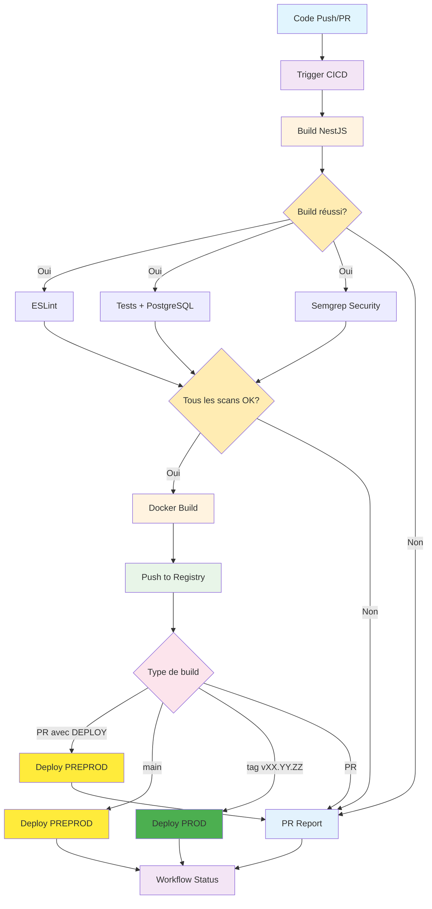

# 🔄 CI/CD Pipeline

## Vue d'ensemble

Le pipeline CI/CD unifié automatise la construction, les tests (unitaires + e2e), la sécurité et le déploiement de l'application backend NestJS avec PostgreSQL dans un seul workflow optimisé.

## 🏗️ Architecture du pipeline



## 📋 Workflow Unifié

### CICD (`cicd.yml`)

**Déclenchement :**
- Push sur `main`
- Push sur les tags `vXX.YY.ZZ`
- Pull requests

**Jobs :**

| Job | Description | Dépendances | Conditions |
|-----|-------------|-------------|------------|
| `build` | Compilation NestJS + Prisma generate | - | - |
| `lint` | Analyse ESLint | `build` | Si build réussit |
| `test` | Tests unitaires + e2e avec PostgreSQL | `build` | Si build réussit |
| `semgrep` | Analyse de sécurité | `build` | Si build réussit |
| `docker` | Build et push image Docker | `build`, `lint`, `test`, `semgrep` | Si tous les jobs précédents réussissent |
| `deploy-preprod` | Déploiement PREPROD | `build`, `lint`, `test`, `semgrep`, `docker` | Si CI réussit ET (main OU PR avec [DEPLOY]) |
| `deploy-prod` | Déploiement PROD | `build`, `lint`, `test`, `semgrep`, `docker` | Si CI réussit ET tag v* |
| `pr-report` | Génération rapport PR | `build`, `lint`, `test`, `semgrep`, `docker`, `deploy-preprod`, `deploy-prod` | Si PR |
| `workflow-status` | Vérification statut final | Tous les jobs | Toujours |

## 🏷️ Stratégie de tagging

| Contexte | Tag | Description |
|----------|-----|-------------|
| **Pull Request** | `unstable` | Version de test |
| **Branche develop** | `dev` | Version de développement |
| **Branche main** | `PREPROD` | Pré-production |
| **Tag vXX.YY.ZZ** | `RELEASE` | Version de production |

## 🔧 Configuration

Les paramètres sont tous configurables dans `devsecops.yml`.
N'oubliez pas de changer la version lorsque vous poussez du code sur main.

### Secrets requis

| Secret | Description | Obligatoire |
|--------|-------------|-------------|
| `COOLIFY_URL` | URL instance Coolify | ✅ |
| `COOLIFY_API_KEY` | Clé API Coolify | ✅ |
| `COOLIFY_APPID_PREPROD_BACKEND` | ID app PREPROD | ✅ |
| `COOLIFY_APPID_PROD_BACKEND` | ID app PROD | ✅ |
| `SEMGREP_APP_TOKEN` | Token Semgrep | ✅ |

## 🔍 Qualité et sécurité

### Tests automatisés

1. **Build NestJS** : Compilation en mode production
2. **ESLint** : Analyse de qualité du code
3. **Tests unitaires** : Tests avec Jest
4. **Tests e2e** : Tests d'intégration avec PostgreSQL
5. **Semgrep** : Analyse de sécurité (JS, TS, Node.js, SQL injection, XSS)
6. **Docker** : Construction d'image sécurisée

### Configuration PostgreSQL pour tests

Le pipeline lance automatiquement une instance PostgreSQL pour les tests :

```yaml
services:
  postgres:
    image: postgres:17-alpine
    env:
      POSTGRES_USER: testuser
      POSTGRES_PASSWORD: testpass
      POSTGRES_DB: testdb
```

### Critères de succès

- ✅ Build NestJS réussi
- ✅ Prisma Client généré
- ✅ ESLint sans erreur
- ✅ Tests unitaires passés
- ✅ Tests e2e passés
- ✅ Semgrep sans vulnérabilité critique
- ✅ Image Docker construite et poussée

### Rapport PR enrichi

Le rapport PR inclut :

- **Statuts complets** : Build, Lint, Tests, Semgrep, Docker, Déploiements
- **Informations de déploiement** : Statuts PREPROD et PROD
- **URLs des environnements** : Liens directs vers les environnements
- **Déploiement sur demande** : Instructions pour `[DEPLOY]`
- **Configuration BDD** : Rappels pour PostgreSQL externe
- **Commandes Docker** : Exemples pour lancer l'image avec variables d'environnement
- **Sections repliables** : Interface propre et organisée

## 🚀 Déploiement

### Environnements

| Environnement | Déclencheur | Tag Docker | Description |
|---------------|-------------|------------|-------------|
| **PREPROD** | Push sur `main` | `PREPROD` | Tests de recette |
| **PREPROD** | PR avec `[DEPLOY]` | `unstable` | Test sur demande |
| **PROD** | Tag `vXX.YY.ZZ` | `RELEASE` | Production |

### Base de données externe

Chaque environnement nécessite :
- Une instance PostgreSQL dans Coolify
- Configuration de `DATABASE_URL` dans les variables d'environnement
- Exécution des migrations Prisma après déploiement

### Déploiement sur demande

Pour déclencher un déploiement PREPROD depuis une Pull Request, ajoutez `[DEPLOY]` dans le titre :

- `[DEPLOY] Ajout de nouvelles fonctionnalités API`
- `Feature: Nouvelle route [DEPLOY]`
- `[DEPLOY] Fix: Correction du bug d'auth`

---

*Pour plus de détails, voir [Déploiement](deployment.md) et [Workflow détaillé](workflow-detailed.md).*
